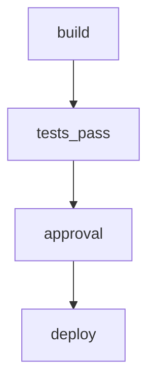

# RFC: effect-workflow - Vendorable DAG Workflow Primitives for Effect

**Status**: Draft
**Author**: Ben Jacobson (with Claude)
**Date**: 2025-10-18
**Inspired By**: ChatGPT DAG/Forms/Entity DSL Proposal

---

## Executive Summary

We propose **`effect-workflow`**, a collection of vendorable components (~480 lines across 6 primitives) for building typed workflow automation with Effect. Think "GitHub Actions meets Effect" - but as copy-pasteable TypeScript, not YAML configuration.

**Core Thesis**: Rather than building another workflow framework, we distill the essence of DAG orchestration into minimal Effect primitives that users vendor and own. These components compose with existing `effect-ci` to create powerful CI/CD pipelines, approval workflows, incident response playbooks, and onboarding automation.

**Key Innovation**: This isn't a workflow engine - it's a **pattern library** showing how Effect primitives (Schema, Service, Layer) naturally express workflow concepts. Users copy ~50-100 line components, customize freely, and maintain forever.

### What You Get

- **DAG Schema** (~80 lines) - Effect Schema types for tasks, gates, edges
- **DAG Interpreter** (~100 lines) - Topological execution with retry/timeout
- **Form Schema** (~70 lines) - Type-safe human-in-the-loop forms with AI hints
- **Compilers** (~100 lines) - Generate GitHub Actions YAML from workflows
- **Transforms** (~70 lines) - Validation, YAML serialization, Mermaid diagrams
- **JSON Schema Compiler** (~60 lines) - Form validation and interop

**Total**: ~480 lines of vendorable TypeScript that composes with 400+ lines of existing `effect-ci`.

---

## Problem Statement

### Current State of Workflow Automation

Developers building workflow automation face a trilemma:

1. **Use SaaS Workflow Platforms** (GitHub Actions, CircleCI, Jenkins)
   - ❌ YAML hell (no types, no refactoring, cryptic syntax)
   - ❌ Vendor lock-in (can't run locally, hard to test)
   - ❌ Limited abstraction (copy-paste between workflows)
   - ✅ Great integrations and UI

2. **Use Code-First Orchestrators** (Temporal, Airflow, Prefect)
   - ✅ Real programming language (Python/TypeScript)
   - ✅ Testable and composable
   - ❌ Heavy runtime dependencies (server, workers, DB)
   - ❌ Learning curve (complex concepts: activities, signals, sagas)
   - ❌ Can't easily compile to GitHub Actions

3. **Build Custom Scripts** (Bash, Make, TypeScript)
   - ✅ Total control and portability
   - ✅ No vendor lock-in
   - ❌ No standard patterns (everyone reinvents DAGs poorly)
   - ❌ No type safety (string errors, runtime failures)
   - ❌ Hard to visualize and reason about

### What's Missing: Vendorable Workflow Primitives

There's a gap between "write YAML" and "run a workflow server":

- **Type-safe DAG definitions** that serialize to JSON/YAML
- **Local execution** with retry, timeout, and error handling
- **Multi-target compilation** (run locally OR generate GitHub Actions)
- **Human-in-the-loop** support (approval gates, forms, SLAs)
- **Composability** with existing Effect code (CI scripts, APIs, ETL)
- **Educational** code that teaches patterns, not magic

### Why Effect is Perfect for This

Effect already provides:

- **Effect Schema** - Type-safe serializable data with validation
- **Effect Service** - Dependency injection for task runners
- **Effect Retry/Timeout** - Built-in resilience patterns
- **Effect Concurrency** - Parallel execution primitives
- **Effect CLI** - Command-line interfaces for workflow runners

We just need to show how these compose into workflow patterns.

---

## Proposed Solution

### effect-workflow as Vendorable Components

Instead of a framework, we provide **6 minimal components** organized into 3 families:

#### Family 1: Workflow Core (DAG Primitives)

1. **`dag-schema.ts`** (~80 lines)
   - Effect Schema types: `Task`, `Gate`, `Collect`, `FanOut`, `FanIn`, `Edge`, `Dag`
   - Ergonomic builders: `task()`, `gate()`, `edge()`, `collect()`
   - Branded `Id` type for type-safe references
   - Retry/backoff configuration

2. **`dag-interpreter.ts`** (~100 lines)
   - Topological DAG execution with `Effect.gen`
   - `TaskRunner` service for dependency injection
   - Parallel execution for independent nodes
   - Retry with exponential backoff
   - Context propagation (form inputs, runtime data)

3. **`dag-transforms.ts`** (~70 lines)
   - YAML serialization (`toDagYaml`, `fromDagYaml`)
   - Cycle detection (`validateDag`)
   - Mermaid diagram generation (`dagToMermaid`)

#### Family 2: Form DSL (Human-in-the-Loop)

4. **`form-schema.ts`** (~70 lines)
   - Effect Schema for inline forms
   - Field types: text, email, select, checkbox, date
   - AI-friendly metadata (`intent`, `synonyms`, `examples`, `pii`)
   - Conditional visibility with `when` expressions

5. **`form-to-json-schema.ts`** (~60 lines)
   - Compile FormIR to JSON Schema Draft 7
   - Support for validation rules, required fields, defaults
   - Interop with Ajv, Zod, etc.

#### Family 3: Compilers (Multi-Target Output)

6. **`compile-to-github-actions.ts`** (~100 lines)
   - Convert DAG to GitHub Actions YAML
   - Maps nodes → jobs, edges → needs, gates → if conditions
   - Handles secrets, env vars, retries
   - Compiles `collect` nodes to workflow_dispatch inputs

**Total**: 480 lines across 6 components

### Architecture Diagram

```
┌─────────────────────────────────────────────────────────────┐
│                     effect-workflow                         │
├─────────────────────────────────────────────────────────────┤
│                                                             │
│  ┌──────────────────────────────────────────────────────┐  │
│  │              DAG Definition (Schema)                 │  │
│  │                                                       │  │
│  │  const workflow: Dag = {                             │  │
│  │    nodes: [                                           │  │
│  │      task("build", { run: "pnpm build" }),           │  │
│  │      gate("tests_pass", "ctx.tests.passed"),         │  │
│  │      collect("approval", "release_form"),            │  │
│  │      task("deploy", { run: "pnpm deploy" })          │  │
│  │    ],                                                 │  │
│  │    edges: [                                           │  │
│  │      edge("build", "tests_pass"),                    │  │
│  │      edge("tests_pass", "approval"),                 │  │
│  │      edge("approval", "deploy")                      │  │
│  │    ]                                                  │  │
│  │  }                                                    │  │
│  └──────────────┬───────────────────────────────────────┘  │
│                 │                                           │
│        ┌────────┴────────┐                                 │
│        │                 │                                 │
│  ┌─────▼──────┐   ┌─────▼──────┐                          │
│  │  Local     │   │  Compile   │                          │
│  │  Execution │   │  to YAML   │                          │
│  └─────┬──────┘   └─────┬──────┘                          │
│        │                 │                                 │
│  ┌─────▼──────┐   ┌─────▼──────────────────┐              │
│  │ Effect     │   │ GitHub Actions YAML    │              │
│  │ Runtime    │   │ AWS Step Functions ASL │              │
│  │ (Services) │   │ Temporal Workflows     │              │
│  └────────────┘   └────────────────────────┘              │
│                                                             │
└─────────────────────────────────────────────────────────────┘
```

---

## Core Concepts

### 1. DAG as Pure Data

Workflows are plain objects validated by Effect Schema:

```typescript
import { Dag, task, gate, edge } from './lib/effect-workflow/dag-schema'

const workflow: Dag = {
  name: "release",
  version: "1.0.0",
  nodes: [
    task("build", { run: "pnpm build" }),
    gate("tests_pass", "ctx.tests.passed == true"),
    task("deploy", { run: "pnpm deploy", secrets: ["DEPLOY_TOKEN"] })
  ],
  edges: [
    edge("build", "tests_pass"),
    edge("tests_pass", "deploy")
  ]
}
```

**Why Pure Data?**
- Serializes to JSON/YAML for storage
- Validates with Effect Schema
- Compiles to multiple targets (GHA, Step Functions, Temporal)
- Easy to test and diff

### 2. Interpreter via Dependency Injection

Execute workflows by providing a `TaskRunner` service:

```typescript
import { runDag } from './lib/effect-workflow/dag-interpreter'
import { Effect, Command } from 'effect'

const runner = {
  runTask: (task: Task) => Command.make("sh", "-c", task.run ?? "true"),
  evaluateExpr: (expr: string, ctx: Record<string, unknown>) =>
    Effect.succeed(true), // Stub; users provide CEL evaluator
  onCollect: (formId: string) =>
    Effect.succeed({ version: "v1.2.3" }) // User input
}

Effect.runPromise(runDag(workflow).pipe(
  Effect.provideService(TaskRunner, runner)
))
```

**Why Dependency Injection?**
- Users customize task execution (shell, HTTP, Effect programs)
- Easy to mock for testing
- Swap implementations (local vs. CI vs. production)

### 3. Forms as Type-Safe Input

Human-in-the-loop workflows use FormIR:

```typescript
import { FormIR } from './lib/effect-workflow/form-schema'

const approvalForm: FormIR = {
  id: "release_approval",
  fields: [
    {
      kind: "text",
      id: "version",
      label: "Version Tag",
      required: true,
      pattern: "^v\\d+\\.\\d+\\.\\d+$",
      ai: { intent: "semver", examples: { version: "v1.2.3" } }
    },
    {
      kind: "checkbox",
      id: "confirm",
      label: "I approve this release",
      required: true
    }
  ]
}
```

Forms compile to:
- **JSON Schema** (for validation)
- **GitHub workflow_dispatch inputs** (for CI)
- **React/Shadcn components** (optional future component)

### 4. Multi-Target Compilation

Same workflow, multiple runtimes:

```typescript
import { toGitHubActions } from './lib/effect-workflow/compile-to-github-actions'
import YAML from 'yaml'

// Generate GitHub Actions YAML
const ghaWorkflow = toGitHubActions(workflow)
console.log(YAML.stringify(ghaWorkflow))

// Or run locally
Effect.runPromise(runDag(workflow).pipe(
  Effect.provideService(TaskRunner, localRunner)
))

// Future: compile to AWS Step Functions
const stepFunctions = toStepFunctionsASL(workflow)
```

---

## Detailed Design

### Component 1: dag-schema.ts (~80 lines)

**Exports**:
- Types: `Task`, `Gate`, `Collect`, `FanOut`, `FanIn`, `Edge`, `Dag`, `Retry`, `Id`
- Builders: `task()`, `gate()`, `collect()`, `fanout()`, `fanin()`, `edge()`

**Key Features**:
- Branded `Id` type prevents string typos
- Union type `NodeCore` enables exhaustive pattern matching
- Retry with exponential backoff configuration
- Serializes cleanly to JSON/YAML

**Example**:
```typescript
export const Id = S.NonEmptyString.pipe(S.brand("NodeId"))

export class Task extends S.Class<Task>("Task")({
  kind: S.Literal("task"),
  id: Id,
  run: S.optional(S.String),
  uses: S.optional(S.String),
  env: S.optional(S.Record({ key: S.String, value: S.String })),
  secrets: S.optional(S.Array(S.String))
}) {}

export const task = (id: string, opts: Partial<Task> = {}): Node => ({
  core: { kind: "task", id: id as Id, ...opts }
})
```

---

### Component 2: dag-interpreter.ts (~100 lines)

**Exports**:
- `runDag(dag: Dag): Effect<void, Error, TaskRunner>`
- `TaskRunner` service interface

**Key Features**:
- Topological sort algorithm for correct execution order
- Parallel execution for independent nodes (`Effect.forEach` with `concurrency: "unbounded"`)
- Retry with exponential backoff via `Effect.retry`
- Timeout support via `Effect.timeout`
- Context propagation (form inputs, runtime metrics)

**Execution Algorithm**:
1. Build adjacency list and compute indegrees
2. Find zero-indegree nodes (entry points)
3. Execute batch in parallel
4. For each completed node:
   - Evaluate outgoing edge conditions
   - Decrement indegree of neighbors
   - Add zero-indegree neighbors to next batch
5. Repeat until all nodes executed

**Example**:
```typescript
export const runDag = (dag: Dag) =>
  Effect.gen(function*() {
    const runner = yield* TaskRunner

    // Build graph
    const nodes = new Map(dag.nodes.map(n => [n.core.id, n]))
    const outgoing = new Map<string, Edge[]>()
    const indegree = new Map<string, number>()

    // Topological execution
    let ready = [...zeroIndegreeNodes]
    const context: Record<string, unknown> = { inputs: {} }

    while (ready.length > 0) {
      yield* Effect.forEach(ready, (id) =>
        Effect.gen(function*() {
          const node = nodes.get(id)!

          // Execute based on node type
          if (node.core.kind === "task") {
            yield* runner.runTask(node.core, context).pipe(
              Effect.retry(buildSchedule(node.retry))
            )
          } else if (node.core.kind === "gate") {
            const pass = yield* runner.evaluateExpr(node.core.expr, context)
            if (!pass) return // Block propagation
          } else if (node.core.kind === "collect") {
            const answers = yield* runner.onCollect(node.core.formId)
            context.inputs[node.core.formId] = answers
          }

          // Propagate to neighbors
          propagateToNeighbors(id, edges, indegree, ready)
        }),
        { concurrency: "unbounded" }
      )
    }
  })
```

---

### Component 3: dag-transforms.ts (~70 lines)

**Exports**:
- `validateDag(dag: Dag): string[]` - Cycle detection + schema validation
- `toDagYaml(dag: Dag): string` - Serialize to YAML
- `fromDagYaml(yaml: string): Dag` - Parse from YAML
- `dagToMermaid(dag: Dag): string` - Generate Mermaid diagram

**Key Features**:
- DFS-based cycle detection with color marking
- Idempotent serialization (round-trip safe)
- Mermaid syntax for GitHub/docs rendering

**Example Mermaid Output**:


---

### Component 4: form-schema.ts (~70 lines)

**Exports**:
- Types: `FieldText`, `FieldSelect`, `FieldCheckbox`, `FieldDate`, `FormIR`, `AIHints`

**Key Features**:
- AI hints for MCP-friendly metadata
- Conditional visibility with `when` expressions
- PII classification for compliance
- Validation rules (pattern, minLength, maxLength)

**Example**:
```typescript
export const AIHints = S.Struct({
  intent: S.optional(S.String),        // "semver", "email", "person_name"
  synonyms: S.optional(S.Array(S.String)),
  examples: S.optional(S.Record({ key: S.String, value: S.String })),
  pii: S.optional(S.Boolean),
  classification: S.optional(S.String) // "person.name", "financial.account"
})

export const FieldText = S.extend(
  FieldBase,
  S.Struct({
    kind: S.Literal("text", "email", "textarea"),
    pattern: S.optional(S.String),
    minLength: S.optional(S.Int),
    maxLength: S.optional(S.Int)
  })
)
```

---

### Component 5: form-to-json-schema.ts (~60 lines)

**Exports**:
- `toJsonSchema(form: FormIR): JSONSchema7`

**Key Features**:
- Maps all field types to JSON Schema equivalents
- Preserves validation rules, required fields, defaults
- Compatible with Ajv, Zod, etc.

**Example**:
```typescript
export const toJsonSchema = (form: FormIR): JSONSchema7 => {
  const properties: Record<string, JSONSchema7> = {}
  const required: string[] = []

  for (const field of form.fields) {
    properties[field.id] = fieldToSchema(field)
    if (field.required) required.push(field.id)
  }

  return {
    $schema: "http://json-schema.org/draft-07/schema#",
    type: "object",
    title: form.title,
    properties,
    required: required.length > 0 ? required : undefined
  }
}
```

---

### Component 6: compile-to-github-actions.ts (~100 lines)

**Exports**:
- `toGitHubActions(dag: Dag): WorkflowYaml`

**Key Features**:
- Maps nodes → jobs, edges → needs
- Gates compile to `if:` conditions
- Secrets map to `${{ secrets.NAME }}`
- `collect` nodes become workflow_dispatch inputs

**Example Compilation**:

**Input DAG**:
```typescript
{
  nodes: [
    task("build", { run: "pnpm build" }),
    gate("tests_pass", "ctx.tests.passed == true"),
    task("deploy", { run: "pnpm deploy" })
  ],
  edges: [
    edge("build", "tests_pass"),
    edge("tests_pass", "deploy")
  ]
}
```

**Output YAML**:
```yaml
name: release
on: [push]
jobs:
  build:
    runs-on: ubuntu-latest
    steps:
      - name: build
        run: pnpm build

  deploy:
    runs-on: ubuntu-latest
    needs: [build]
    if: ctx.tests.passed == true
    steps:
      - name: deploy
        run: pnpm deploy
```

---

## Example Workflows

### Example 1: Release with Canary + Approval

```typescript
const approvalForm: FormIR = {
  id: "release_approval",
  fields: [
    {
      kind: "text",
      id: "version",
      label: "Version Tag",
      required: true,
      pattern: "^v\\d+\\.\\d+\\.\\d+$",
      ai: { intent: "semver", examples: { version: "v1.2.3" } }
    },
    {
      kind: "checkbox",
      id: "testsPass",
      label: "All tests passing?",
      required: true
    }
  ]
}

const releaseWorkflow: Dag = {
  name: "release-with-approval",
  defaults: {
    retry: {
      maxAttempts: 3,
      backoff: { type: "exponential", baseMs: 500, factor: 2, maxMs: 10000 }
    }
  },
  nodes: [
    task("checkout", { uses: "actions/checkout@v4" }),
    collect("approval", "release_approval"),

    fanout("build_parallel"),
    task("build_web", { run: "pnpm build --filter web" }),
    task("build_api", { run: "pnpm build --filter api" }),
    fanin("build_done"),

    task("canary", { run: "pnpm deploy:canary" }),
    gate("canary_healthy", "ctx.metrics.errorRate < 0.5"),

    task("deploy_prod", { run: "pnpm deploy:prod", secrets: ["DEPLOY_TOKEN"] })
  ],
  edges: [
    edge("checkout", "approval"),
    edge("approval", "build_parallel"),
    edge("build_parallel", "build_web"),
    edge("build_parallel", "build_api"),
    edge("build_web", "build_done"),
    edge("build_api", "build_done"),
    edge("build_done", "canary"),
    edge("canary", "canary_healthy"),
    edge("canary_healthy", "deploy_prod")
  ]
}
```

**Flow**:
1. Checkout code
2. **Pause for human approval** (collect node)
3. Build web and API in parallel (fanout)
4. Wait for both builds (fanin)
5. Deploy to canary
6. Check metrics (gate)
7. Deploy to production if healthy

---

### Example 2: Incident Response with Severity Branching

```typescript
const triageForm: FormIR = {
  id: "incident_triage",
  fields: [
    {
      kind: "text",
      id: "title",
      label: "Incident Title",
      required: true
    },
    {
      kind: "select",
      id: "severity",
      label: "Severity",
      options: [
        { value: "SEV-1", label: "SEV-1 (Critical)" },
        { value: "SEV-2", label: "SEV-2 (High)" },
        { value: "SEV-3", label: "SEV-3 (Medium)" }
      ],
      required: true
    }
  ]
}

const incidentWorkflow: Dag = {
  name: "incident-response",
  nodes: [
    collect("triage", "incident_triage"),

    gate("is_sev1", "inputs.incident_triage.severity == 'SEV-1'"),

    // SEV-1 path
    task("page_execs", { run: "ops notify execs" }),
    task("legal_sync", { run: "ops legal --brief" }),

    // All severities
    task("page_oncall", { run: "ops page --user oncall" }),
    task("create_room", { run: "ops room create" }),

    task("postmortem", { run: "ops postmortem init" })
  ],
  edges: [
    edge("triage", "is_sev1"),
    edge("is_sev1", "page_execs"),
    edge("is_sev1", "legal_sync"),
    edge("triage", "page_oncall"),
    edge("triage", "create_room"),
    edge("page_oncall", "postmortem"),
    edge("create_room", "postmortem"),
    edge("page_execs", "postmortem"),
    edge("legal_sync", "postmortem")
  ]
}
```

---

## Integration with effect-ci

`effect-workflow` composes with existing `effect-ci` components:

```typescript
import { ReleasePlan, runPlan } from './lib/effect-ci/release-plan'
import { Dag, task, edge } from './lib/effect-workflow/dag-schema'

const weeklyReleaseWorkflow: Dag = {
  name: "weekly-release-automation",
  nodes: [
    task("fetch_commits", { run: "git fetch origin main" }),
    task("generate_notes", { run: "npx tsx lib/effect-ci/release-plan.ts run" }),
    task("create_release", { run: "gh release create $(cat tag.txt) -F notes.md" })
  ],
  edges: [
    edge("fetch_commits", "generate_notes"),
    edge("generate_notes", "create_release")
  ]
}
```

**Synergy**:
- `effect-ci` provides **content generation** (release notes via Claude)
- `effect-workflow` provides **orchestration** (approval gates, deployment steps)

---

## Implementation Plan

### Phase 1: Core Workflow (Week 1)
**Goal**: Minimal viable workflow system

**Deliverables**:
- `dag-schema.ts` (~80 lines)
- `dag-interpreter.ts` (~100 lines)
- `compile-to-github-actions.ts` (~100 lines)
- Example: `release-basic.ts`

**Success Criteria**:
- Example runs locally with mock runner
- Generates valid GitHub Actions YAML
- Passes `actionlint` validation

---

### Phase 2: Form Integration (Week 2)
**Goal**: Human-in-the-loop workflows

**Deliverables**:
- `form-schema.ts` (~70 lines)
- `form-to-json-schema.ts` (~60 lines)
- Example: `release-with-approval.ts`

**Success Criteria**:
- Form schema validates with Effect Schema
- JSON Schema compiler works for all field types
- Form answers flow into task context

---

### Phase 3: Polish & Documentation (Week 3)
**Goal**: Production-ready components

**Deliverables**:
- `dag-transforms.ts` (~70 lines)
- `docs/specs/effect-workflow.md`
- Update `registry.json`
- 3-4 detailed examples

**Success Criteria**:
- Cycle detection catches invalid DAGs
- Mermaid diagrams render in GitHub
- All components registered
- Comprehensive spec document

---

## Alternatives Considered

### Alternative 1: Build Full Workflow Engine

**Approach**: Create a runtime server with durable execution, web UI, worker pools.

**Pros**:
- Feature parity with Temporal/Airflow
- Visual workflow builder
- Production-grade retry/recovery

**Cons**:
- ❌ Not vendorable (requires infrastructure)
- ❌ Heavy dependencies (database, message queue)
- ❌ Violates Meta Effect philosophy (minimal primitives)
- ❌ Can't compile to GitHub Actions

**Decision**: Rejected. Conflicts with vendorable component model.

---

### Alternative 2: YAML-First (Like GitHub Actions)

**Approach**: Define workflows in YAML, compile to TypeScript runners.

**Pros**:
- Familiar to GitHub Actions users
- Simple for basic workflows

**Cons**:
- ❌ No type safety in authoring
- ❌ Hard to refactor/compose
- ❌ No IDE support (autocomplete, errors)
- ❌ Doesn't teach Effect patterns

**Decision**: Rejected. TypeScript-first with YAML as compilation target is superior.

---

### Alternative 3: Extend effect-ci Instead of New Family

**Approach**: Add workflow primitives to existing `effect-ci` components.

**Pros**:
- Fewer top-level categories
- Tighter integration

**Cons**:
- ❌ Conflates "CI automation" with "general workflows"
- ❌ Makes `effect-ci` less focused
- ❌ Workflows are broader than CI/CD (onboarding, incident response, approvals)

**Decision**: Rejected. Separate family maintains focus and discoverability.

---

## Open Questions

### 1. Expression Evaluator - CEL/JEXL/Custom?

**Current Plan**: Start with stub; users provide implementation.

**Future Options**:
- Vendorable `cel-evaluator.ts` (~60 lines) using `@celsandbox/cel-js`
- Simple evaluator using `Function()` constructor (unsafe but minimal)
- Integration guide for existing libraries (jsonata, jexl)

**Decision Needed**: Should we include a default evaluator or leave it pluggable?

---

### 2. Form Parser - Concise DSL vs. TypeScript-Only?

**Current Plan**: Users define FormIR in TypeScript. Optional `form-parser.ts` for concise syntax.

**Concise DSL Example**:
```
section "Release"
  text version "Tag" pattern=^v\\d+\\.\\d+\\.\\d+$ required
  select env "Environment" options=prod|staging required
```

**TypeScript Example**:
```typescript
const form: FormIR = {
  id: "release",
  fields: [
    { kind: "text", id: "version", label: "Tag", pattern: "^v...", required: true },
    { kind: "select", id: "env", label: "Environment", ... }
  ]
}
```

**Decision Needed**: Is concise DSL worth ~90 lines? Or keep TypeScript-only for simplicity?

---

### 3. Entity DSL - Defer or Include?

**ChatGPT Proposal** included entity definitions (Employee, Device, etc.) with:
- Field types (text, date, ref, enum)
- Lifecycle states (DRAFT → PENDING → ACTIVE)
- Relationships (Employee → Manager)

**Current Plan**: Defer to Phase 4. Users can define entities with plain Effect Schema.

**Decision Needed**: Is there demand for domain modeling primitives? Or is Effect Schema sufficient?

---

### 4. Assignment & SLA Tracking - Out of Scope?

**ChatGPT Proposal** included:
- Assignee rules (user, role, group, expression-based)
- SLA tracking with escalation
- Round-robin assignment strategies

**Current Plan**: Out of scope. Users integrate with external systems (Linear, Jira, PagerDuty).

**Rationale**: Requires durable state (DB, cron, timers) which conflicts with vendorable philosophy.

**Decision Needed**: Is there a minimal vendorable version of assignment tracking?

---

### 5. Form Renderer - Generate Code or Runtime Component?

**Current Plan**: `form-to-react-shadcn.ts` generates TypeScript source code from FormIR.

**Alternative**: Runtime component that renders FormIR dynamically.

**Trade-offs**:
- **Code Generation**: Users own the output, can customize, no runtime dependency
- **Runtime Rendering**: Smaller bundle, dynamic forms, harder to customize

**Decision Needed**: Which approach better fits vendorable philosophy?

---

## Success Metrics

### Phase 1 Complete When:
- [ ] 3 core components (schema, interpreter, compiler)
- [ ] Example runs locally and generates valid GHA YAML
- [ ] All components ≤ 100 lines
- [ ] Zero dependencies beyond `effect`, `@effect/platform`

### Phase 2 Complete When:
- [ ] Form schema + JSON Schema compiler working
- [ ] Example shows collect node + form validation
- [ ] Form answers accessible in task context

### Phase 3 Complete When:
- [ ] Cycle detection, YAML, Mermaid working
- [ ] Complete spec document
- [ ] Registry updated
- [ ] 3-4 examples documented

---

## Timeline

- **Week 1** (Phase 1): Core workflow primitives + basic example
- **Week 2** (Phase 2): Form integration + approval example
- **Week 3** (Phase 3): Transforms, validation, docs

**Total Effort**: ~1 week (5-7 days)

---

## Philosophy Check

- ✅ **Minimal**: Each component 50-100 lines, focused on one concern
- ✅ **Vendorable**: Copy into project, users own and customize
- ✅ **Composable**: Components work together but independently usable
- ✅ **Effect-first**: Every operation is an Effect; leverages Effect primitives
- ✅ **Framework-Aware**: Integrates with GitHub Actions, AWS, etc.
- ✅ **Educational**: Code teaches Effect patterns through examples
- ✅ **Zero Magic**: All behavior explicit; no hidden abstractions

---

## Related Work

- **GitHub Actions** - YAML workflows; inspiration for multi-target compilation
- **AWS Step Functions** - ASL (Amazon States Language); DAG as JSON
- **Temporal** - Durable execution; inspiration for retry/timeout patterns
- **Airflow** - Python DAGs; proof that code > YAML
- **CUE** - Configuration language; inspiration for data-first schemas
- **effect-ci** - Existing Meta Effect components for CI/CD

---

## FAQ

### Q: Why not just use GitHub Actions?

**A**: GitHub Actions is great! We compile to it. But:
- Testing workflows locally is hard
- YAML has no types or refactoring
- Can't reuse logic across workflows
- Vendor lock-in (can't run on AWS, local, etc.)

`effect-workflow` lets you author in TypeScript, run locally, AND generate GHA YAML.

---

### Q: Why not use Temporal?

**A**: Temporal is amazing for production durable execution. But:
- Requires server infrastructure (Temporal cluster, workers, DB)
- Can't compile to GitHub Actions
- Steeper learning curve (activities, signals, queries)
- Not vendorable (you depend on Temporal packages/runtime)

`effect-workflow` is complementary - use it for CI/CD, approvals, simple automation. Graduate to Temporal when you need durable execution.

---

### Q: How does this compare to Airflow/Prefect?

**A**: Similar goals (typed DAG workflows) but different approach:
- **Airflow/Prefect**: Python-first, requires server, visual UI
- **effect-workflow**: TypeScript vendorable primitives, multi-target compilation

Use Airflow for data pipelines in production. Use `effect-workflow` for CI/CD, approvals, onboarding automation.

---

### Q: Can I use this in production?

**A**: Yes, but understand the trade-offs:
- ✅ Local execution: Production-ready (it's just Effect programs)
- ✅ GitHub Actions compilation: Production-ready (generates standard YAML)
- ⚠️ Durable execution: Not built-in; integrate with Temporal/AWS Step Functions
- ⚠️ SLA tracking: Requires external integration (Linear, PagerDuty)

---

## Next Steps

1. **Community Feedback** - Gather input on RFC (open questions, scope, timeline)
2. **Rename Branch** - `effect-workflow-dsl` ✅ (done)
3. **Begin Phase 1** - Implement `dag-schema.ts`, `dag-interpreter.ts`, `compile-to-github-actions.ts`
4. **Create Spec Stub** - Outline `docs/specs/effect-workflow.md`
5. **Write Tests** - Vitest suite for each component

**RFC Status**: Awaiting feedback and approval.

---

**Ready to build?** 🚀
