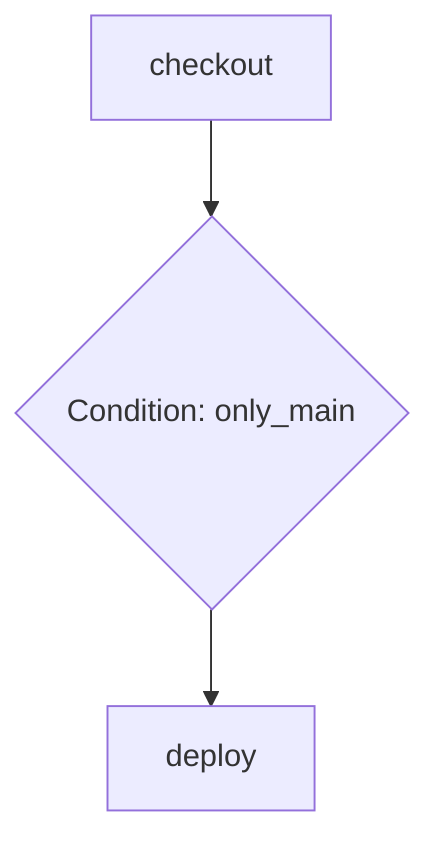

# effect-dag Specification

**Status**: Planned
**Components**: See [`registry/effect-dag/`](../../registry/effect-dag/) (to be created)
**Last Updated**: 2025-10-18

## Overview

`effect-dag` is a collection of vendorable components (~500 lines total) for building typed workflow orchestration with Effect. These aren't CI-specific - they're general-purpose primitives for any directed acyclic graph execution: data pipelines, business processes, state machines, task automation.

Think "Airflow/Temporal meets Effect" - but as copy-pasteable TypeScript, not a workflow server.

**Core Thesis**: Workflow orchestration is a general-purpose primitive that appears across many domains (CI/CD, data pipelines, business automation). By providing minimal DAG primitives as Effect schemas and services, users can build complex workflows that execute locally OR compile to multiple platforms (GitHub Actions, AWS Step Functions, etc.).

**Components**:
- DAG primitives (~500 lines): dag-types, dag-builder, dag-validation, dag-workflow, dag-interpreter, dag-to-mermaid

## Core Primitives

### 1. DAG Types (Effect Schema Definitions)

Core Effect Schema types for workflow primitives (~136 lines):

```typescript
import { task, gate, fanout, fanin, edge } from './lib/effect-dag/dag-types'
import type { TaskNode, GateNode, FanoutNode, FaninNode } from './lib/effect-dag/dag-types'

// Node types with branded IDs
const checkoutNode: TaskNode = {
  _tag: "task",
  id: "checkout" as NodeId,
  uses: "actions/checkout@v4",
  env: { CI: "true" }
}

const gateNode: GateNode = {
  _tag: "gate",
  id: "only_main" as NodeId,
  condition: "github.ref == 'refs/heads/main'"
}

const fanoutNode: FanoutNode = {
  _tag: "fanout",
  id: "parallel_builds" as NodeId
}
```

**Type Definitions**:
- `NodeId` - Branded string for node identifiers
- `TaskNode` - Run shell command or use action (validates uses XOR run)
- `GateNode` - Conditional execution gate
- `FanoutNode` - Trigger parallel execution branches
- `FaninNode` - Wait for parallel branches to complete
- `CollectNode` - Pause for human input (integrates with effect-collect)
- `Edge` - Connection between nodes with optional condition
- `Trigger` - Push/PR/Schedule workflow triggers
- `RetryPolicy` - Retry configuration with exponential backoff

### 2. DAG Builder (Ergonomic Constructors)

Builder functions for constructing workflows (~90 lines):

```typescript
import { task, gate, fanout, fanin, edge } from './lib/effect-dag/dag-builder'

const nodes = [
  task("checkout", { uses: "actions/checkout@v4" }),
  gate("only_main", "github.ref == 'refs/heads/main'"),
  fanout("parallel_builds"),
  task("build_web", { run: "pnpm build --filter web" }),
  task("build_api", { run: "pnpm build --filter api" }),
  task("test_api", {
    run: "pnpm test:api",
    env: { CI: "true" },
    retry: { maxAttempts: 3 }
  }),
  fanin("join_builds"),
  task("release", {
    run: "pnpm release",
    secrets: ["NPM_TOKEN"]
  }),
]

const edges = [
  edge("checkout", "only_main"),
  edge("only_main", "parallel_builds", "expr"),
  edge("parallel_builds", "build_web"),
  edge("parallel_builds", "build_api"),
  edge("build_api", "test_api"),
  edge("build_web", "join_builds"),
  edge("test_api", "join_builds"),
  edge("join_builds", "release"),
]
```

**Builder Functions**:
- `task(id, config)` - Create task node (run or uses)
- `gate(id, condition)` - Create conditional gate
- `fanout(id)` - Create parallel fanout
- `fanin(id)` - Create parallel join
- `edge(from, to, condition?)` - Create node connection

### 3. DAG Validation (Pure Validation Functions)

Validation functions for DAG correctness (~173 lines):

```typescript
import { validateDAG } from './lib/effect-dag/dag-validation'
import { Effect } from 'effect'

const result = await Effect.runPromise(
  validateDAG({ nodes, edges })
)
// Returns validated config or ParseResult errors
```

**Validation Functions**:
- `validateEdgeReferences()` - All edges reference existing nodes
- `validateNoSelfLoops()` - No node → node edges
- `validateGateConditions()` - Gate nodes can't have "never" condition
- `validateNoCycles()` - DFS cycle detection
- `validateDAG()` - Run all validations in sequence

### 4. DAG Workflow DSL (Declarative API)

High-level declarative API inspired by Effect RPC/HttpApi patterns (~210 lines):

```typescript
import { Workflow, Task, Gate, Fanout, Fanin, Edge } from './lib/effect-dag/dag-workflow'
import { PushTrigger } from './lib/effect-dag/dag-types'

// Define workflow as a class (like RpcGroup)
class BuildAndRelease extends Workflow.make(
  "build_and_release",
  "1.0.0",
  {
    triggers: [PushTrigger.make({ branches: ["main"] })],
    defaults: {
      retry: { maxAttempts: 3 },
      env: { NODE_ENV: "production" }
    }
  },
  // Nodes (like Rpc.make)
  Task.make("checkout", { uses: "actions/checkout@v4" }),
  Gate.make("only_main", { condition: "github.ref == 'refs/heads/main'" }),
  Fanout.make("parallel_builds"),
  Task.make("build_web", { run: "pnpm build --filter web" }),
  Task.make("build_api", { run: "pnpm build --filter api" }),
  Fanin.make("join_builds"),
  Task.make("release", { run: "pnpm release", secrets: ["NPM_TOKEN"] }),
  // Edges
  Edge.make("checkout", "only_main"),
  Edge.make("only_main", "parallel_builds", { condition: "expr" }),
  Edge.make("parallel_builds", "build_web"),
  Edge.make("parallel_builds", "build_api"),
  Edge.make("build_web", "join_builds"),
  Edge.make("build_api", "join_builds"),
  Edge.make("join_builds", "release")
) {}

// Use the workflow
const config = BuildAndRelease.config
const validated = BuildAndRelease.parseSync()

// Or with Effect
const program = BuildAndRelease.parse().pipe(
  Effect.tap(() => Effect.log("Workflow validated"))
)
```

**Why this DSL?**
- **RPC-like**: Familiar to Effect users (mirrors `RpcGroup.make()`)
- **Type-safe**: Full TypeScript inference for nodes and edges
- **Declarative**: Define entire workflow in one class expression
- **Composable**: Can extend or combine workflow classes
- **Self-documenting**: Workflow structure visible at a glance

### 5. DAG Interpreter (Local Execution Engine)

Execute DAG workflows locally with topological sorting, retry, and timeout (~100 lines):

```typescript
import { runDag, TaskRunner } from './lib/effect-dag/dag-interpreter'
import { Effect, Command } from 'effect'

// Define task runner service
const localRunner: TaskRunner = {
  runTask: (task: TaskNode, context: Record<string, unknown>) =>
    Effect.gen(function*() {
      if (task.run) {
        // Execute shell command
        const result = yield* Command.make("sh", "-c", task.run).pipe(
          Command.exitCode
        )
        if (result !== 0) {
          return yield* Effect.fail(new Error(`Task ${task.id} failed`))
        }
      } else if (task.uses) {
        // Handle GitHub Actions
        console.log(`Would run action: ${task.uses}`)
      }
    }),

  evaluateGate: (gate: GateNode, context: Record<string, unknown>) =>
    Effect.gen(function*() {
      // Evaluate condition (integrate with effect-expressions)
      const evaluator = yield* ExpressionEvaluator
      return yield* evaluator.evalBoolean(gate.condition, context)
    }),

  onFanout: (fanout: FanoutNode) =>
    Effect.log(`Starting parallel execution: ${fanout.id}`),

  onFanin: (fanin: FaninNode) =>
    Effect.log(`Joining parallel execution: ${fanin.id}`)
}

// Execute workflow locally
const program = runDag(BuildAndRelease.config).pipe(
  Effect.provideService(TaskRunner, localRunner)
)

Effect.runPromise(program)
```

**Key Features**:
- **Topological Sort**: Executes nodes in dependency order
- **Parallel Execution**: Runs independent nodes concurrently
- **Retry/Timeout**: Per-node retry policies and timeouts
- **Context Propagation**: Passes data between nodes
- **Error Handling**: Typed errors with node context
- **Service-Based**: Swap execution strategy via dependency injection

**Execution Algorithm**:
1. Build adjacency list from edges
2. Compute indegree for each node
3. Find zero-indegree nodes (entry points)
4. Execute batch in parallel using `Effect.forEach` with unbounded concurrency
5. For each completed node:
   - Evaluate outgoing edge conditions
   - Decrement indegree of neighbors
   - Add zero-indegree neighbors to next batch
6. Repeat until all nodes executed or gate blocks propagation

### 6. DAG to Mermaid (Visualization)

Generate Mermaid diagrams from DAG workflows (~50 lines):

```typescript
import { dagToMermaid } from './lib/effect-dag/dag-to-mermaid'

const diagram = dagToMermaid(BuildAndRelease.config)
console.log(diagram)

// Output:
// graph TD
//   checkout --> only_main
//   only_main --> parallel_builds
//   parallel_builds --> build_web
//   parallel_builds --> build_api
//   build_web --> join_builds
//   build_api --> join_builds
//   join_builds --> release
//
//   only_main{only_main}
//   parallel_builds((parallel_builds))
//   join_builds((join_builds))
```

**Node Shapes**:
- `Task` → Rectangle `[task]`
- `Gate` → Diamond `{gate}`
- `Fanout/Fanin` → Circle `((fanout))`
- `Collect` → Stadium `([collect])`

**GitHub Integration**:
```markdown
<!-- In README.md or docs/ -->
## Workflow Diagram


```

GitHub automatically renders Mermaid diagrams in markdown!

## Architecture Diagram

```
┌─────────────────────────────────────────────────────────────┐
│                 DAG Definition (Schema)                      │
│                  (Single Source of Truth)                    │
├─────────────────────────────────────────────────────────────┤
│                                                              │
│  class MyWorkflow extends Workflow.make(                    │
│    "my_workflow",                                            │
│    "1.0.0",                                                  │
│    { triggers: [...] },                                      │
│    Task.make("build", { run: "pnpm build" }),               │
│    Gate.make("tests_pass", { condition: "..." }),           │
│    Task.make("deploy", { run: "pnpm deploy" }),             │
│    Edge.make("build", "tests_pass"),                        │
│    Edge.make("tests_pass", "deploy")                        │
│  ) {}                                                        │
│                                                              │
└────────────────┬────────────────────────────────────────────┘
                 │
        ┌────────┴────────┐
        │                 │
┌───────▼──────┐   ┌──────▼───────┐
│   Validate   │   │   Execute    │
│              │   │   Locally    │
└───────┬──────┘   └──────┬───────┘
        │                 │
┌───────▼──────┐   ┌──────▼───────┐
│ validateDAG  │   │  runDag      │
│ (cycle check)│   │ (interpreter)│
└──────────────┘   └──────┬───────┘
                          │
                   ┌──────▼───────────┐
                   │  TaskRunner      │
                   │  (DI Service)    │
                   └──────┬───────────┘
                          │
              ┌───────────┼────────────┐
              │           │            │
        ┌─────▼────┐ ┌────▼─────┐ ┌───▼──────┐
        │  Shell   │ │  HTTP    │ │  Custom  │
        │ Commands │ │ Requests │ │ Executor │
        └──────────┘ └──────────┘ └──────────┘

OR

        ┌────────────────────────────────────────────┐
        │           Compile to Targets               │
        │        (via effect-compilers)              │
        └────────────┬───────────────────────────────┘
                     │
        ┌────────────┼────────────┬──────────────┐
        │            │            │              │
┌───────▼──────┐ ┌──▼────────┐ ┌─▼──────────┐ ┌─▼──────┐
│   GitHub     │ │    AWS    │ │  Terraform │ │ Mermaid│
│   Actions    │ │    Step   │ │    HCL     │ │Diagram │
│     YAML     │ │ Functions │ │            │ │        │
└──────────────┘ └───────────┘ └────────────┘ └────────┘
```

## Key Design Decisions

### 1. Why General-Purpose DAGs?

DAGs are not CI-specific. They apply to:
- **Data Pipelines**: ETL, batch processing (Airflow, Luigi)
- **Business Processes**: Approval workflows, onboarding automation
- **State Machines**: AWS Step Functions, game AI behavior trees
- **Build Systems**: Dependency resolution (Bazel, Buck)
- **Scientific Computing**: Computational workflows (Nextflow, Snakemake)

By keeping DAG primitives general, they compose with domain-specific tools (effect-ci, effect-prisma, etc.).

### 2. Why Effect Service Pattern for Interpreter?

**Dependency Injection** enables:
- **Testing**: Mock task execution
- **Local Development**: Run shell commands
- **Production**: HTTP requests to APIs
- **Custom Logic**: Integrate with existing systems

Same DAG definition, different execution strategies:
```typescript
// Local dev: shell commands
const devRunner = createShellRunner()

// Production: HTTP API calls
const prodRunner = createHttpRunner({ apiUrl: "https://api.example.com" })

// Testing: mocked responses
const testRunner = createMockRunner({ "build": { success: true } })
```

### 3. Why Declarative DSL?

**Workflow.make()** pattern mirrors Effect RPC:
- Familiar to Effect users
- Type-safe construction
- Compile-time validation
- IDE autocomplete

Alternative (lower-level builder API) also available for dynamic construction.

### 4. Why Vendorable?

Users customize:
- Task execution (shell, HTTP, custom integrations)
- Gate evaluation (CEL, JavaScript, custom rules)
- Error handling (retry policies, escalation)
- Compilation targets (GitHub Actions, Step Functions, etc.)

Copy once, own forever. No framework updates.

## Implementation Status

### ✅ Planned Components

- **dag-types.ts** (~136 lines)
  - Node, Edge, Trigger Effect Schema types
  - Branded NodeId type
  - RetryPolicy with exponential backoff

- **dag-builder.ts** (~90 lines)
  - Ergonomic builder functions
  - task(), gate(), fanout(), fanin(), edge()

- **dag-validation.ts** (~173 lines)
  - Cycle detection (DFS)
  - Edge reference validation
  - Gate condition validation

- **dag-workflow.ts** (~210 lines)
  - Declarative Workflow.make() DSL
  - Task, Gate, Fanout, Fanin, Edge helpers
  - Integration with dag-types

- **dag-interpreter.ts** (~100 lines)
  - TaskRunner service interface
  - Topological sort execution
  - Parallel node execution
  - Retry/timeout support

- **dag-to-mermaid.ts** (~50 lines)
  - Generate Mermaid diagram from DAG
  - Different shapes for node types

### 🚧 Future Enhancements

- **dag-config.ts** - JSON/YAML serialization helpers
- **dag-composition.ts** - Embed sub-DAGs
- **dag-cache.ts** - Compiled expression caching
- **dag-repl.ts** - Interactive DAG debugging REPL

## Usage Examples

### Example 1: Data Pipeline

```typescript
import { Workflow, Task, Gate, Edge } from './lib/effect-dag/dag-workflow'

class ETLPipeline extends Workflow.make(
  "etl_pipeline",
  "1.0.0",
  {},
  Task.make("extract", { run: "python extract.py --source postgres" }),
  Task.make("transform", { run: "python transform.py --input data.csv" }),
  Gate.make("quality_check", { condition: "ctx.rowCount > 1000" }),
  Task.make("load", { run: "python load.py --target warehouse" }),
  Edge.make("extract", "transform"),
  Edge.make("transform", "quality_check"),
  Edge.make("quality_check", "load")
) {}

// Execute locally
const program = runDag(ETLPipeline.config).pipe(
  Effect.provideService(TaskRunner, createShellRunner())
)
```

### Example 2: Business Process Automation

```typescript
import { Workflow, Task, Collect, Gate, Edge } from './lib/effect-dag/dag-workflow'
import { CollectService } from './lib/effect-collect/collect-service'

class EmployeeOnboarding extends Workflow.make(
  "employee_onboarding",
  "1.0.0",
  {},
  Collect.make("gather_info", { formId: "employee_form" }),
  Fanout.make("provision_parallel"),
  Task.make("create_email", { run: "it provision email" }),
  Task.make("create_slack", { run: "it provision slack" }),
  Task.make("create_github", { run: "it provision github" }),
  Fanin.make("provision_done"),
  Task.make("assign_buddy", { run: "hr assign-buddy" }),
  Task.make("send_welcome", { run: "comms send-welcome" }),
  // Edges...
) {}

// Execute with collection service
const program = runDag(EmployeeOnboarding.config).pipe(
  Effect.provideService(TaskRunner, createOnboardingRunner()),
  Effect.provideService(CollectService, createSlackCollector({ channel: "#hr" }))
)
```

### Example 3: State Machine

```typescript
class OrderFulfillment extends Workflow.make(
  "order_fulfillment",
  "1.0.0",
  {},
  Task.make("validate_order", { run: "validate-order" }),
  Gate.make("in_stock", { condition: "inventory.available >= order.quantity" }),
  Task.make("charge_card", { run: "payment charge" }),
  Gate.make("payment_success", { condition: "payment.status == 'success'" }),
  Task.make("pick_items", { run: "warehouse pick" }),
  Task.make("pack_order", { run: "warehouse pack" }),
  Task.make("ship_order", { run: "shipping create-label" }),
  Task.make("send_notification", { run: "notify customer" }),
  // Edges define state transitions...
) {}
```

### Example 4: Multi-Target Compilation

```typescript
import { compileDagToGitHubActions } from './lib/effect-compilers/dag-to-github-actions'
import { compileDagToStepFunctions } from './lib/effect-compilers/dag-to-step-functions'
import { dagToMermaid } from './lib/effect-dag/dag-to-mermaid'

const workflow = BuildAndRelease.config

// Execute locally in dev
if (process.env.NODE_ENV === "development") {
  await Effect.runPromise(runDag(workflow))
}

// Compile to GitHub Actions for CI
const gha = await Effect.runPromise(compileDagToGitHubActions(workflow))
fs.writeFileSync(".github/workflows/build.yml", YAML.stringify(gha))

// Compile to Step Functions for production
const stepFn = await Effect.runPromise(compileDagToStepFunctions(workflow))
fs.writeFileSync("infra/state-machine.json", JSON.stringify(stepFn, null, 2))

// Generate documentation
const diagram = dagToMermaid(workflow)
fs.writeFileSync("docs/workflow.md", `\`\`\`mermaid\n${diagram}\n\`\`\``)
```

## Integration with Other Primitives

### With effect-collect (Human-in-the-Loop)

```typescript
import { CollectService } from './lib/effect-collect/collect-service'

const runnerWithCollect: TaskRunner = {
  runTask: (node, ctx) =>
    Effect.gen(function*() {
      if (node._tag === "collect") {
        const collect = yield* CollectService
        const data = yield* collect.collect(node.formId)
        ctx[node.formId] = data
      } else {
        // Normal task execution
        yield* Command.make("sh", "-c", node.run)
      }
    }),
  // ...
}
```

### With effect-expressions (Gate Evaluation)

```typescript
import { ExpressionEvaluator } from './lib/effect-expressions/expr-service'

const runnerWithExpressions: TaskRunner = {
  evaluateGate: (gate, ctx) =>
    Effect.gen(function*() {
      const evaluator = yield* ExpressionEvaluator
      return yield* evaluator.evalBoolean(gate.condition, ctx)
    }),
  // ...
}
```

### With effect-ci (CI Automation)

```typescript
import { Git, GH } from './lib/effect-ci/shell-runner'
import { runPlan } from './lib/effect-ci/release-plan'

class ReleaseWorkflow extends Workflow.make(
  "release",
  "1.0.0",
  {},
  Task.make("fetch", { run: "git fetch origin main" }),
  Task.make("generate_notes", { run: "npx tsx lib/effect-ci/release-plan.ts run" }),
  Task.make("publish", { run: "gh release create" }),
  // Edges...
) {}
```

## Customization Patterns

### Custom Task Execution

```typescript
const httpRunner: TaskRunner = {
  runTask: (task, ctx) =>
    Effect.gen(function*() {
      // Execute tasks via HTTP API
      const response = yield* fetch(`https://api.example.com/tasks/${task.id}`, {
        method: "POST",
        body: JSON.stringify({ command: task.run, context: ctx })
      })

      if (!response.ok) {
        return yield* Effect.fail(new Error(`Task ${task.id} failed`))
      }
    }),
  // ...
}
```

### Conditional Retry

```typescript
const smartRetryRunner: TaskRunner = {
  runTask: (task, ctx) =>
    Effect.gen(function*() {
      const baseExecution = yield* executeTask(task)

      // Only retry transient errors
      return yield* baseExecution.pipe(
        Effect.retry({
          while: (error) => error.type === "TransientError",
          schedule: Schedule.exponential("100 millis", 2.0)
        })
      )
    }),
  // ...
}
```

### DAG Composition

```typescript
// Define reusable sub-workflows
const buildWorkflow = Workflow.make(
  "build",
  "1.0.0",
  {},
  Task.make("install", { run: "pnpm install" }),
  Task.make("build", { run: "pnpm build" }),
  Edge.make("install", "build")
)

const testWorkflow = Workflow.make(
  "test",
  "1.0.0",
  {},
  Task.make("test", { run: "pnpm test" }),
  Task.make("lint", { run: "pnpm lint" })
)

// Compose into main workflow
class MainWorkflow extends Workflow.make(
  "main",
  "1.0.0",
  {},
  // Embed sub-workflows
  SubWorkflow.make("build_phase", buildWorkflow),
  SubWorkflow.make("test_phase", testWorkflow),
  Task.make("deploy", { run: "pnpm deploy" }),
  Edge.make("build_phase", "test_phase"),
  Edge.make("test_phase", "deploy")
) {}
```

## Testing Strategy

### Unit Tests (Schema Validation)

```typescript
import { describe, it, expect } from 'vitest'
import { validateDAG } from './dag-validation'

describe('dag-validation', () => {
  it('detects cycles', async () => {
    const dag = {
      nodes: [
        { _tag: "task", id: "a", run: "echo a" },
        { _tag: "task", id: "b", run: "echo b" }
      ],
      edges: [
        { from: "a", to: "b" },
        { from: "b", to: "a" } // Cycle!
      ]
    }

    await expect(
      Effect.runPromise(validateDAG(dag))
    ).rejects.toThrow("cycle")
  })
})
```

### Integration Tests (Execution)

```typescript
import { describe, it, expect } from 'vitest'
import { runDag } from './dag-interpreter'

describe('dag-interpreter', () => {
  it('executes tasks in topological order', async () => {
    const executionOrder: string[] = []

    const mockRunner: TaskRunner = {
      runTask: (task) =>
        Effect.sync(() => {
          executionOrder.push(task.id)
        }),
      // ...
    }

    const workflow = Workflow.make(
      "test",
      "1.0.0",
      {},
      Task.make("a", { run: "echo a" }),
      Task.make("b", { run: "echo b" }),
      Task.make("c", { run: "echo c" }),
      Edge.make("a", "b"),
      Edge.make("b", "c")
    )

    await Effect.runPromise(
      runDag(workflow.config).pipe(
        Effect.provideService(TaskRunner, mockRunner)
      )
    )

    expect(executionOrder).toEqual(["a", "b", "c"])
  })
})
```

## Performance Characteristics

- **DAG Validation**: O(V + E) - linear in nodes and edges
- **Topological Sort**: O(V + E) - linear time
- **Execution**: Bounded by longest path + parallel speedup
- **Memory**: O(V + E) for adjacency list

Example: 100-node DAG with 150 edges
- Validation: ~5ms
- Compilation: ~50ms
- Local execution: Depends on task duration (parallel where possible)

## Open Questions

1. **Sub-Workflows**: Should we support embedding DAGs within DAGs?
2. **Dynamic DAGs**: How to handle workflows that generate nodes at runtime?
3. **Stateful Execution**: Should we provide durable state storage (resume failed workflows)?
4. **Observability**: Built-in tracing/logging or user-provided?
5. **Rate Limiting**: Should interpreter support rate-limited task execution?

## Related Documents

### Meta Effect Specs
- [effect-collect Spec](./effect-collect.md) - Human-in-the-loop primitives (collect nodes in DAGs)
- [effect-expressions Spec](./effect-expressions.md) - Expression evaluators (gate conditions)
- [effect-compilers Spec](./effect-compilers.md) - Multi-target code generation (DAG → GHA/Step Functions)
- [effect-ci Spec](./effect-ci.md) - CI/CD automation (uses effect-dag for workflows)
- [effect-forms Spec](./effect-forms.md) - Form schemas (used with collect nodes)

### External Docs
- [Effect Service Pattern](https://effect.website/docs/context-management/services) - Dependency injection
- [Effect Schema](https://effect.website/docs/schema) - Schema validation
- [Airflow DAGs](https://airflow.apache.org/docs/apache-airflow/stable/concepts/dags.html) - Inspiration
- [AWS Step Functions](https://docs.aws.amazon.com/step-functions/latest/dg/concepts-states.html) - ASL spec

## Contributing

This is a living document. As users customize `effect-dag`, we update this spec with:
- New node types (custom primitives)
- Integration examples (Prisma, Drizzle, HTTP APIs)
- Execution strategies (distributed, serverless)
- Performance optimizations
- Community feedback

See [registry README](../../registry/README.md) for vendoring instructions.
